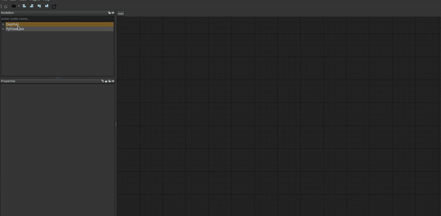
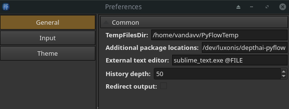
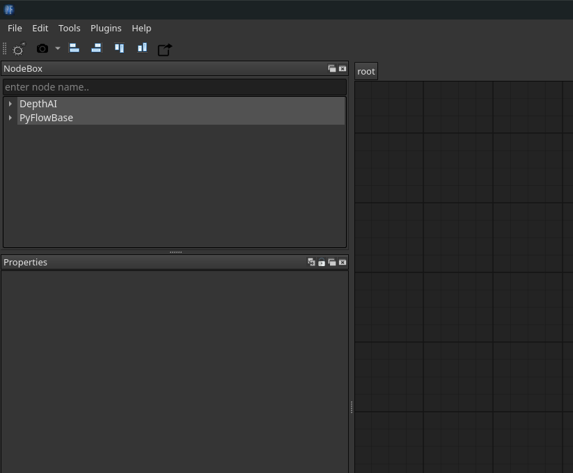

# DepthAI-PyFlow
**DepthAI-PyFlow** is a easy to use rapid prototyping GUI tool for creating custom AI pipelines on **DepthAI** hardware. 
**DepthAI-PyFlow** enables you to drag and drop building blocks and compose a desired pipeline, that when exported, will be able to run and produce 
desired results - with no coding needed! 

 

**PyFlow** is a general-purpose Visual Dataflow Programming library. Nodes represent algorithms with certain inputs and outputs. Connections transfer data from the output (source) of the first node to the input (sink) of the second one. **DepthAI-PyFlow** is a visual scripting extension for PyFlow for DepthAI.

# Installation
**DepthAI-PyFlow is not a standalone software, it is an extension package of PyFlow. PyFlow has to be installed first.** You can refer to [PyFlow Project](https://github.com/wonderworks-software/PyFlow)  to install PyFlow.

The easy way to install PyFlow is::
```bash
    pip install git+https://github.com/wonderworks-software/PyFlow.git@master
```

After PyFlow installed through pip or setup.py.

Clone or download PyFlowOpenCV repository
```bash
    git clone https://github.com/luxonis/DepthAI-PyFlow.git
```
Install requirements for your use case::

```bash
    pip install -r requirements.txt
```

To run the program in standalone mode, you can invoke pyflow.exe on windows or pyflow on unix OS. Program is located inside PATH/TO/PYTHON/Scripts. You can also 
run pyflow.py in the root folder of PyFlow(not DepthAI-PyFlow) project.

You can enable the DepthAI-PyFlow package by one of the following ways ( Just pick one, not all).

- put the addition package path to 'Additional package locations' on preferences dialog.Make sure you add path of PyFlow/Packages under DepthAI-PyFlow project to the 'additional package location' edit.
 
- Copy the DepthAI-PyFlow package to .PyFlow/Packages
- User can add location of package to env variable for PYTHONPATH
- Paths listed in PYFLOW_PACKAGES_PATHS env variable (; separated string)

If everything works out, you should able to see 'DepthAI' in your NodeBox dialog of the GUI.

 


## Getting Started

To allow you to start smoothly:
- [PyFlow documentation](https://pyflow.readthedocs.io/en/latest/) will allow you to understand how to use GUI
- [Here's an issue](https://github.com/luxonis/depthai/issues/136) describing the overall concept of this tool
- [DepthAI documentation](https://docs.luxonis.com/) describing what the DepthAI is and how to use it
- [DepthAI store](https://shop.luxonis.com/) for you to grab one of the DepthAI device and deploy built pipeline to it


## Discussion / Support

Join us to our [discuss](https://discuss.luxonis.com/) / [slack](https://join.slack.com/t/luxonis-community/shared_invite/zt-emg3tas3-C_Q38TI5nZbKUazZdxwvXw) or [write us and email](mailto:support@luxonis.com) or [post comment under original issue](https://github.com/luxonis/depthai/issues/136)
and ask anything related to project! 
Please also let us know what features you'd need to achieve your goal with DepthAI - we'll be happy to help!